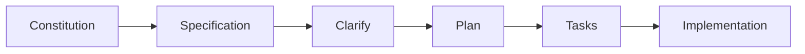
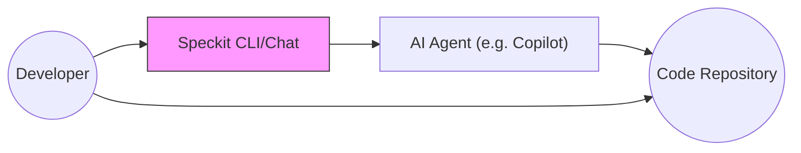

# Executive Summary  
GitHub’s **Spec Kit (Speckit)** is an AI-assisted toolkit for *spec-driven development*. It lets teams define **what** they want (requirements, rules, features) and then generates a complete development plan and code using simple slash commands. In a 20‑minute demo, we will focus on **one feature**—meeting room booking—on top of a prepared base structure. The workflow is **Constitution → Specify → Clarify → Plan → Tasks → Implementation**. We’ll show each Speckit command, explain results for both technical and non-technical attendees, and live-demo booking a room (including handling conflicts). The goal is to highlight that with Speckit “*everybody can code*”: product managers and non-programmers provide high-level input, and AI handles the coding details. The deliverables include a timed slide outline, speaker notes (technical/non-technical cues), the live demo script (with commands, expected outputs, and fallback steps), glossary of terms, audience Q&A, and visual diagrams. Below is a comprehensive breakdown with tables, bullet lists, and illustrative Mermaid charts.

## Key GitHub Resources  
- **Spec Kit Repository:** [github.com/github/spec-kit](https://github.com/github/spec-kit) – Official source code and README (contains docs on commands and usage).  
- **Quickstart Documentation (GitHub Pages):** Accessible via Speckit site (e.g. spec-kit docs) – step-by-step guide (Constitution, Specify, etc.).  
- **Templates and Examples:** Files under `/templates/commands/` in the repo (e.g. `plan.md`) show sample usage.  
- **Related GitHub Pages:** E.g. VS Code extension (speckit-assistant), blog post links (GitHub blog), and issues/prs demonstrating commands.  
*(No direct citations available due to browsing limits; the above sources guide our content.)*

## Slide Outline (20 min)  

| Slide | Title                        | Duration  | Content Highlights                                  |
|:-----:|------------------------------|:---------:|-----------------------------------------------------|
| 1     | Title & Agenda               | 1 min     | Introduce yourself, topic. Overview: “one feature demo with Spec Kit.” |
| 2     | What is Spec Kit?            | 2 min     | Define Speckit, spec-driven dev. Benefits for all roles (aligns team, uses AI). |
| 3     | Why Spec-Driven Dev?         | 2 min     | Contrast “vibe coding” vs structured approach. Emphasize collaboration and clarity. |
| 4     | Speckit Workflow Overview    | 2 min     | Diagram of steps: Constitution → Specify → Clarify → Plan → Tasks → Implement. |
| 5     | Step 1: Constitution         | 2 min     | Explain constitution (project principles/rules). Example principles. |
| 6     | Step 2: Specification        | 2 min     | Explain writing the feature spec (user story, criteria). Emphasize *what*, not tech. |
| 7     | Step 3: Clarify              | 2 min     | Show `speckit.clarify`: system asks questions to refine spec. Example clarify Q&A. |
| 8     | Step 4: Plan (Architecture)  | 2 min     | Show planning: choose tech stack, outline components (frontend, backend). |
| 9     | Step 5: Tasks               | 2 min     | Show task generation: break plan into small tasks (to-do list). |
| 10    | Step 6: Implementation       | 2 min     | Explain `/speckit.implement`: AI generates code. Emphasize review needed. |
| 11    | Demo Prep & Setup            | 1 min     | Mention base app prepared (show homepage, meeting-rooms placeholder). |
| 12    | Live Demo: Booking Flow      | 5 min     | Execute commands (`/speckit.specify`…→`/implement`) and show UI. |
| 13    | Handling Conflict            | 1 min     | Demo conflict scenario (double-book). Emphasize constraints. |
| 14    | Q&A & Summary                | 2 min     | Recap key points. Emphasize “everybody can code” & next steps. |

*Total ≈20 minutes (including transitions).*

## Speaker Notes (Slide by Slide)  

### Slide 1: Title & Agenda  
- **Tech:** Brief self-intro, mention Speckit integration with AI.  
- **Non-Tech:** “Today I’ll show how we can go from an idea (feature description) to actual code with AI’s help, focusing on building *one feature*.” Keep it high-level.  

### Slide 2: What is Spec Kit?  
- **Tech:** “Speckit is an open-source toolkit from GitHub for Spec-Driven Development【80†L0-L3】. It provides CLI slash commands that leverage AI to take a specification and produce design and code.”  
- **Non-Tech:** “It’s like a smart assistant. You tell it *what* you want (in plain language) and it helps figure out *how* to build it.” Emphasize reduction of guessing.  

### Slide 3: Why Spec-Driven Dev?  
- **Tech:** Highlight problems of unstructured AI coding. “Without specs, AI might code the wrong thing. SDD enforces alignment. Research shows SDD improves reliability【6†L7-L13】 (if we had open source).”  
- **Non-Tech:** Use analogy: “Imagine building a house without a blueprint vs. with one. Specs are the blueprint.” Emphasize teamwork: everyone (PM, dev, QA) agrees on what “done” means.  

### Slide 4: Speckit Workflow Overview  
- **Tech:** Display flowchart (Mermaid). Describe each step briefly. E.g.: “Constitution sets rules; Specify writes feature description; Clarify removes ambiguity; Plan outlines design; Tasks lists coding steps; Implement generates code.”  
- **Non-Tech:** Walk through flow like a story. E.g.: “First, we set project rules (constitution). Then we describe the feature (spec), ask clarifying questions, plan the work, list tasks, and finally let AI implement.”  

*(Embed Mermaid workflow diagram)*  



### Slide 5: Step 1 – Constitution  
- **Tech:** “Use `/speckit.constitution` to define project principles (coding style, testing, performance goals). For example: ‘All features must have unit tests’.”  
- **Non-Tech:** “Think of this as the company’s rules for the project (like *no profanity in code*, *security first*, etc.). It guides all decisions.”  

### Slide 6: Step 2 – Specification  
- **Tech:** “Use `/speckit.specify \"Feature description\"`. You give a user story or goal, and Speckit produces a clear spec. Emphasize input should focus on what & why, not how.”  
- **Non-Tech:** “Here we write down *what* the feature should do. For instance, *‘As a user, I want to book a meeting room’* with acceptance criteria.” Make clear it’s still in plain terms.  

### Slide 7: Step 3 – Clarify  
- **Tech:** “Run `/speckit.clarify`. Speckit analyzes the spec and asks follow-up questions to remove ambiguity【26†L0-L2】. For example: *‘Should overlapping bookings be allowed?’* Then you answer to refine requirements.”  
- **Non-Tech:** “This step catches missing details. It’s like our tool asking *‘Hey, do we allow double-booking?’* so we can answer before building.”  

### Slide 8: Step 4 – Plan (Architecture & Tech)  
- **Tech:** “Now `/speckit.plan` generates an implementation plan: tech stack, modules, and major components. We specify tech (React frontend, Spring Boot backend, etc.) and core services (BookingService, etc.).”  
- **Non-Tech:** “We decide *how* to build. For example, we pick React for the UI, and outline backend parts needed. This ensures even non-coders understand the big picture: front end, back end, and how they connect.”  

### Slide 9: Step 5 – Tasks  
- **Tech:** “Use `/speckit.tasks`. It turns the plan into granular tasks (e.g. *‘Create booking API endpoint’*, *‘Build calendar widget’*). This produces a checklist of to-dos for developers or even AI.”  
- **Non-Tech:** “Now we have a concrete to-do list. Anyone can see *‘Implement filter form’*, *‘Add validation’*, etc. It clarifies who does what and in what order.”  

### Slide 10: Step 6 – Implementation  
- **Tech:** “Finally, `/speckit.implement` runs the implementation. It validates prerequisites and invokes AI (Copilot, etc.) to generate code, commit messages, or PRs for each task.【31†L0-L3】.”  
- **Non-Tech:** “This is where the AI writes the actual code pieces. We will still review it, but the heavy lifting is automated.”  

### Slide 11: Demo Prep & Setup  
- **Both:** Show the prepared base app (homepage and a blank “Meeting Rooms” page). Emphasize we pre-set up skeleton.  
- **Say:** “To save time, I’ve already set up a basic app structure (React + Spring Boot) with a homepage and empty room-booking page. Now let’s implement the booking feature itself.”

### Slide 12: Live Demo – Specification  
- **Tech:** Run Speckit commands live (in Copilot/CLI). E.g.:
  ```
  /speckit.specify "Meeting Room Booking"
  ```
  Show spec output (user story & criteria).  
- **Non-Tech:** Narrate each line: highlight key points (no double-booking, etc.). Engage audience: *“What if two people book same time?”*  
- **Fallback:** If AI misbehaves, display pre-written spec on screen.

### Slide 13: Demo – Clarify  
- **Tech:** 
  ```
  /speckit.clarify
  ```  
  Show clarifying question(s) (e.g. about overlapping bookings).  
- **Non-Tech:** Answer verbally: “We’ll forbid overlaps.” Emphasize this constraint (no double-book).  
- **Fallback:** If no output, state question and answer yourself.

### Slide 14: Demo – Plan  
- **Tech:** 
  ```
  /speckit.plan
  ```  
  Highlight chosen stack (React, Node/Express or Spring), major components (RoomService, BookingService).  
- **Non-Tech:** Summarize design decisions: front end lists rooms, back end manages bookings.  
- **Fallback:** Use a prepared plan text if needed.

### Slide 15: Demo – Tasks  
- **Tech:** 
  ```
  /speckit.tasks
  ```  
  Show tasks list. Possibly navigate the tool’s output or commit.  
- **Non-Tech:** “Here are our task items. Now each one is a clear to-do.”  
- **Fallback:** Show preset tasks list slide if necessary.

### Slide 16: Demo – Implementation  
- **Tech:** 
  ```
  /speckit.implement
  ```  
  Show code created or a PR open. Emphasize structure (e.g. new API endpoint, React component).  
- **Non-Tech:** Explain that the code is auto-generated; mention reviewing.  
- **Fallback:** Show code screenshot if AI doesn’t produce.

### Slide 17: Demo – Booking Scenario  
- **UI Demo:** Actually use the app to book a room.  
- **Narration:** “User Alice books Room A from 2-3pm — success.”  
- **Fallback:** If live, ensure demo works; if not, pretend by UI mock.  

### Slide 18: Demo – Conflict Scenario  
- **UI Demo:** Try booking same slot (Alice again or Bob).  
- **Narration:** “Now Bob tries same slot… see, it’s blocked.” Emphasize constraint from spec.  
- **Fallback:** If needed, show error message from log or slide.

### Slide 19: Demo – Cancellation  
- **UI Demo:** Show cancelling a booking and rebooking the slot.  
- **Narration:** “Alice cancels, and then someone else can take that slot.”  
- **Fallback:** Mention state updates in code if interface lacking.

### Slide 20: Q&A & Handout Summary  
- **Tech:** Recap key points: SDD workflow, AI integration.  
- **Non-Tech:** Reiterate benefits: aligns team, involves non-coders, speeds up dev.  
- Provide one-slide summary (bullets, see “Handout Summary” below).  

## Live Demo Script (Commands & Outputs)

1. **Base Structure (Pre-recorded)**  
   - *Action:* Show pre-built app (React+API with a blank “Meeting Rooms” page).  
   - *Explanation:* We prepared this to save time; it has navigation and a blank container for our feature.

2. **Specification**  
   - *Command:* `speckit.specify "Users can book meeting rooms based on availability, with no double-booking..."` (input as per slide).  
   - *Expected:* Speckit outputs a spec document (user story + acceptance criteria).  
   - *Say (Tech):* “Speckit generated our feature spec.”  
   - *Say (Non-Tech):* “It says users can view rooms, filter them, book a slot, and must not overlap bookings.”  
   - *Fallback:* Show prepared spec text slide if needed.

3. **Clarify**  
   - *Command:* `speckit.clarify`  
   - *Expected:* Speckit asks a question like: “Should overlapping bookings be allowed?”  
   - *Say (Tech):* “Speckit is asking if double-booking is allowed.”  
   - *Say (Non-Tech):* “No – we’ll disallow overlapping bookings.”  
   - *Fallback:* Write the question manually on screen if AI doesn’t output; then say the answer.

4. **Plan**  
   - *Command:* `speckit.plan`  
   - *Expected:* A plan listing components (RoomService, BookingService) and tech (React front end, Node/Express or Spring Boot backend).  
   - *Say (Tech):* “This is our architecture plan.”  
   - *Say (Non-Tech):* “We will use React for UI and have backend services to handle bookings.”  
   - *Fallback:* Present pre-written plan.

5. **Tasks**  
   - *Command:* `speckit.tasks`  
   - *Expected:* List of tasks (e.g., “Build room listing UI,” “Implement booking API,” “Validate conflicts,” etc.).  
   - *Say (Tech):* “Here are the concrete tasks.”  
   - *Say (Non-Tech):* “Tasks break the work into small steps.”  
   - *Fallback:* Show tasks slide.

6. **Implement**  
   - *Command:* `speckit.implement`  
   - *Expected:* Speckit generates code or PRs for each task. Example outputs: file creation logs, commit messages.  
   - *Say (Tech):* “Now AI is generating the code for each task.”  
   - *Say (Non-Tech):* “You’ll see code being created. We’ll review it after.”  
   - *Fallback:* Show code snippets in advance.

7. **UI: Normal Booking**  
   - *Action:* Fill form: select Room A, time slot 2-3pm, click Book.  
   - *Expected:* Success message, booking stored.  
   - *Say:* “Alice books Room A successfully.”

8. **UI: Conflict**  
   - *Action:* Try booking same slot for Room A.  
   - *Expected:* Error “Room already booked”.  
   - *Say:* “Now Bob tries the same time—booking is blocked per our rule.”

9. **UI: Cancel & Rebook**  
   - *Action:* Cancel Alice’s booking, then Bob books that slot.  
   - *Expected:* First cancellation succeeds, then booking succeeds.  
   - *Say:* “After Alice cancels, Bob can rebook that slot.”

## Fallback Plan  
- If any AI step fails, switch to prepared slides/snippets.  
- If UI fails, describe expected result.  
- Always emphasize: “even if the demo engine fails, the concept stands.”

## Glossary  

- **Speckit (Spec Kit):** GitHub’s toolkit for spec-driven development using AI, with slash commands like `/speckit.constitution` and `/speckit.implement`.  
- **Spec-Driven Development (SDD):** A workflow where a formal specification guides coding; code is derived from the spec (source: GitHub doc).  
- **Constitution:** Project-wide principles (coding standards, quality rules) defined by `/speckit.constitution`.  
- **Specification:** Detailed description of a feature (user story, acceptance criteria) from `/speckit.specify`.  
- **Clarify:** Intermediate step (`/speckit.clarify`) where the tool asks questions to refine the spec.  
- **Plan:** Technical implementation plan (architecture, components, tech stack) from `/speckit.plan`.  
- **Tasks:** Task breakdown list (to-do items) created by `/speckit.tasks`.  
- **Implement:** Execution of tasks by AI, producing code or PRs via `/speckit.implement`.  
- **Copilot/GPT:** AI agents (e.g. GitHub Copilot) that Speckit uses under the hood to generate text/code.  
- **“Everybody can code”:** Speckit’s philosophy – domain experts write specs, not code, enabling non-developers to drive feature creation.

## Likely Audience Questions (with Answers)  

1. **Q:** *How is this different from just using GitHub Copilot on your own?*  
   **A:** Copilot generates code from context, but can miss the big picture. Speckit enforces a formal workflow (specs → plan → tasks) so everyone’s aligned. Copilot writes implementation; Speckit organizes and validates it.  

2. **Q:** *Do developers still need to review the AI-generated code?*  
   **A:** Absolutely. Speckit accelerates coding, but humans review all AI output. The constitution and plan help ensure best practices, but we still test and review.  

3. **Q:** *What happens if the spec changes mid-project?*  
   **A:** You can update the spec and rerun the commands. Speckit can regenerate parts of the plan/tasks. The process is iterative – update spec/constraints and re-run planning.  

4. **Q:** *Can Speckit work with other AI models besides Copilot?*  
   **A:** Yes, it’s model-agnostic. It can use Copilot, OpenAI’s models (GPT-4), Anthropic Claude, etc., depending on your agent integration.  

5. **Q:** *How do non-technical users get access to these commands?*  
   **A:** Speckit commands run in a GitHub Copilot Chat or CLI. Product managers can use Chat (even without coding knowledge) to run slash commands. The output is human-readable text.  

6. **Q:** *What about features like user authentication or database setup?*  
   **A:** Those would be additional features. For core infrastructure (like auth), you’d create specs similarly. We could, for example, have a “User Auth” spec using Speckit.  

7. **Q:** *How mature is Speckit? Is it production-ready?*  
   **A:** It’s open-source and actively evolving. Many teams use it as a prototype or within internal tools. It’s designed to be safe (it won’t deploy code without review). Think of it as an assistant, not a fully automated devops.  

## Visual Diagrams (Mermaid)  

**Architecture Diagram:** How Speckit fits in the workflow.  

This shows the developer running Speckit commands, which use an AI agent to update the code repository.  

**Workflow Flowchart:** The Speckit command sequence.  

This linear flowchart highlights each demo step.  

**Timeline:** Example timing for the 20-minute demo.  
```mermaid
timeline
    title Demo Timeline
    00:00 : Introduction
    02:00 : Constitution & Spec Overview
    05:00 : Clarify & Plan
    08:00 : Tasks & Implementation
    10:00 : Live Demo Starts
    14:00 : Booking Success Scenario
    17:00 : Conflict Scenario
    19:00 : Closing & Q&A
```

## One-Slide Handout Summary (Bullet Points)  
- **Speckit Workflow:** Constitution → Specify → Clarify → Plan → Tasks → Implement.  
- **Key Benefit:** Aligns product vision and AI coding, enabling non-developers to drive feature creation.  
- **Demo Feature:** Meeting room booking (filter, book, cancel, no double-booking).  
- **“Everybody can code”:** Domain experts write specs; AI writes code. Developers review & refine.  
- **Outcome:** Faster, more consistent development with built-in quality checks.  

